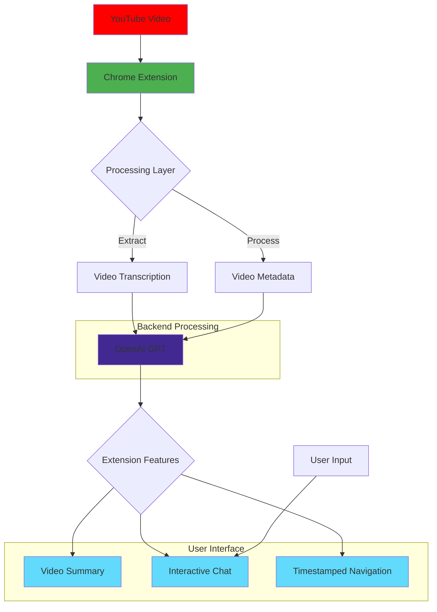

# YouTube AI Extension 🤖

Transform your YouTube experience with an intelligent Chrome extension that lets you interact with video content in unprecedented ways. Built with React, TailwindCSS, and powered by OpenAI's GPT, this extension brings conversational AI capabilities directly to your YouTube browsing experience.


## ✨ Features

### 🎯 Key Capabilities
- **Smart Video Summaries**: Get instant, AI-generated summaries of any YouTube video
- **Interactive Transcription**: Navigate videos with searchable, timestamped transcriptions
- **AI Chat Interface**: Have conversations about video content with our GPT-powered assistant
- **Context-Aware Responses**: Get intelligent answers based on video content and transcripts

### 🎨 User Experience
- Clean, modern interface built with TailwindCSS
- Seamless integration with YouTube's native UI
- Responsive design that adapts to your browsing preferences
- Real-time interactions with minimal latency

## 🛠️ Technical Stack

- **Frontend**: React 18.2.0
- **Styling**: TailwindCSS with animations
- **Extension Framework**: Plasmo 0.86.3
- **AI Integration**: OpenAI GPT API
- **Messaging**: @plasmohq/messaging 0.6.2
- **UI Components**: Custom components with tailwind-merge

## 🚀 Installation

1. Clone the repository
```bash
git clone https://github.com/KoldAd1b/youtube-ext
```

2. Install dependencies
```bash
npm install
```

3. Build the extension
```bash
npm run build
```

4. Load the extension in Chrome:
   - Open Chrome and navigate to `chrome://extensions/`
   - Enable "Developer mode"
   - Click "Load unpacked"
   - Select the `build` directory

## 💡 Usage

1. Navigate to any YouTube video
2. Click the extension icon in your browser
3. Use the provided interface to:
   - Generate video summaries
   - View and search transcriptions
   - Chat with the AI about video content

## 🔧 Development

```bash
# Start development server
npm run dev

# Build for production
npm run build

```

## Architecture Diagram



## Package.json Dependencies

```json
{
  "dependencies": {
    "@plasmohq/messaging": "^0.6.2",
    "clsx": "^2.1.1",
    "openai": "^4.49.1",
    "plasmo": "0.86.3",
    "react": "18.2.0",
    "react-dom": "18.2.0",
    "react-textarea-autosize": "^8.5.3",
    "tailwind-merge": "^2.3.0",
    "tailwindcss-animate": "^1.0.7"
  }
}
```


## 🙏 Acknowledgments

- Built with [Plasmo](https://docs.plasmo.com/)
- Powered by [OpenAI](https://openai.com/)
- Styled with [TailwindCSS](https://tailwindcss.com/)


Thank you very much ❤️
